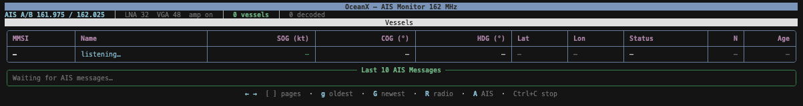
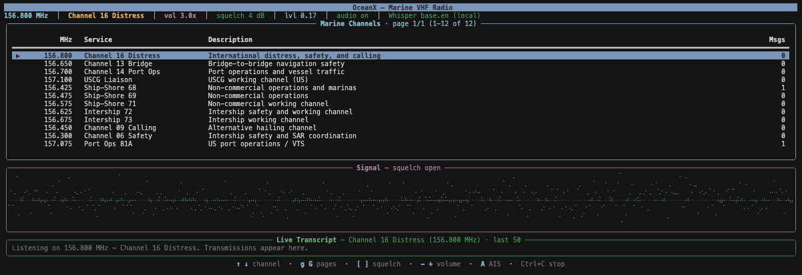

# OceanX

**OceanX** is a terminal-based marine monitoring app for the [HackRF One](https://greatscottgadgets.com/hackrf/one/) focused on **AIS vessel tracking** and **marine VHF voice monitoring** on coastal and inland waterways.

```
   ___                    __  __
  /___\___ ___  __ _ _ __ \ \/ /
 //  // __/ _ \/ _` | '_ \ \  / 
/ \_// (_|  __/ (_| | | | |/  \ 
\___/ \___\___|\__,_|_| |_/_/\_\
```

## Features

- AIS dashboard (default) on 161.975 / 162.025 MHz with vessel table and message feed
- Marine radio dashboard on 156-163 MHz with channel list, waveform, squelch, and STT transcript
- HackRF retune between AIS and radio dashboards in one terminal UI
- Config auto-created at `~/.config/oceanx/config.json`
- Logs written to `~/.oceanx/logs/`
  - `ais.log` for AIS message summaries
  - `radio_MHZ.log` for per-frequency STT transcript lines

## Screenshots

Examples from a live HackRF session (macOS terminal, Rich UI):

### AIS dashboard

Vessel table with MMSI, name, speed, course, and position, plus a scrolling AIS message feed. Press **`A`** to return here from radio mode.



### Marine VHF radio monitor

Marine channel list, braille signal scope, live transcript, squelch/volume controls, and speaker audio. Press **`R`** from AIS to enter; **`A`** to return.



## Requirements

- macOS
- Python 3.11+
- HackRF tools

```bash
brew install hackrf
```

## Quick Start

```bash
cd oceanx
make dev-install
./start.sh
```

Entry points:

- `python -m oceanx`
- `./start.sh`
- `oceanx` (after `make install` or `make dev-install`)

## Configuration

OceanX stores config in `~/.config/oceanx/config.json` and creates defaults on first run.

| Key | Type | Default | Description |
|---|---|---|---|
| `lna` | int | `32` | HackRF LNA gain |
| `vga` | int | `48` | HackRF VGA gain |
| `amp_enable` | bool | `true` | Enable HackRF RF amp |
| `sound_enabled` | bool | `true` | Play discovery ping on first MMSI seen |
| `refresh_hz` | float | `2.0` | UI refresh frequency |
| `show_banner` | bool | `true` | Show startup banner |
| `replay_file` | string/null | `null` | Optional IQ replay file path |
| `ais_channels` | list | AIS A/B defaults | Configurable AIS channel list (`id`, `name`, `freq_mhz`, `description`) |
| `radio_channels` | list | marine defaults | Configurable marine channel list (`id`, `name`, `freq_mhz`, `description`) |

Default `ais_channels`:

- AIS Channel A — `161.975`
- AIS Channel B — `162.025`

## Keyboard Shortcuts

Global:

- `A` - AIS dashboard
- `R` - Radio dashboard
- `Ctrl+C` - Exit

AIS dashboard:

- `[` / `]` or `←` / `→` - table page back/forward
- `g` - oldest first
- `G` - newest first

Radio dashboard:

- `↑` / `↓` - select channel
- `g` / `G` - channel page up/down
- `[` / `]` - squelch down/up
- `-` / `+` - volume down/up

## Marine Channel Defaults

Includes common channels such as:

- Ch 16 (156.800) distress/calling
- Ch 13/14 bridge and port operations
- Ch 22A USCG liaison
- Ch 68/69/71/72/73 ship-shore/intership
- Additional common calling/working channels

## Development

```bash
make dev-install
make format
make test
```

CI runs:

- `black --check`
- `pytest`
- Python `3.11`, `3.12`, and `3.13`
